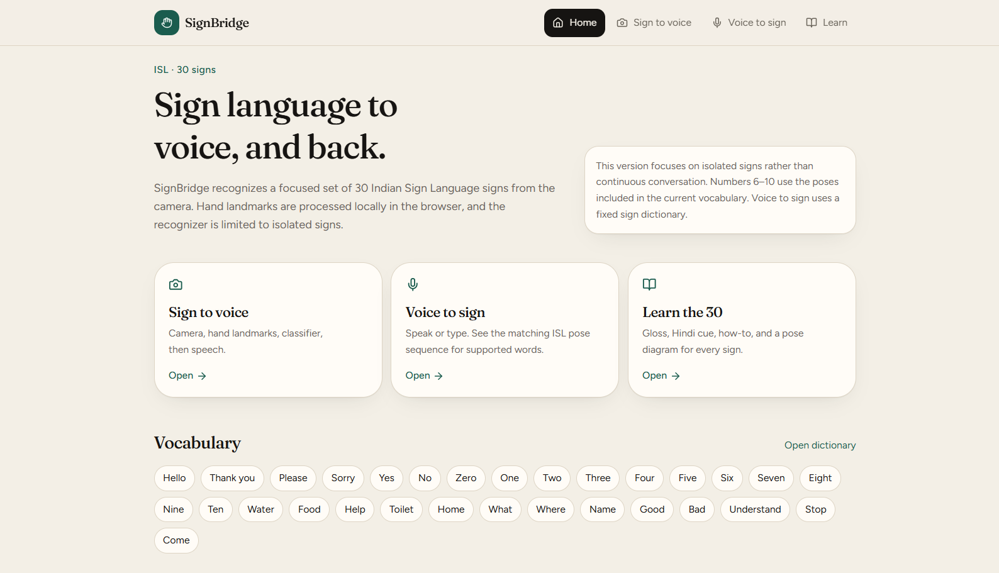

# SignBridge

**SignBridge** is a browser-based prototype exploring two-way communication between Indian Sign Language (ISL) and spoken language.

The current web prototype includes:

- **Sign → Voice:** camera-based hand-landmark tracking with experimental sign recognition and text-to-speech.
- **Voice → Sign:** speech or text input mapped to a searchable sign vocabulary.
- **Learn:** searchable sign cards with English and Hindi glosses.
- **Privacy-first direction:** camera and microphone processing are intended to remain in the browser.

> **Important:** This is an experimental isolated-sign prototype—not a continuous, grammar-aware ISL translation system. Recognition is heuristic and may produce incorrect or unknown results.

## Preview



## Features

- 30-sign vocabulary prototype
- One- and two-hand tracking through MediaPipe
- Browser-side landmark feature extraction
- Experimental rule-based recognition
- Confidence filtering and temporal smoothing
- Browser text-to-speech output
- Voice/text-to-sign dictionary flow
- Searchable learning vocabulary
- Responsive interface built with React and Tailwind CSS

## Tech stack

- React
- TypeScript
- Vite
- TanStack Router / TanStack Start
- MediaPipe hand landmarks
- Tailwind CSS
- Browser Web Speech API

## Run locally

Requirements:

- Node.js 18+
- A modern browser with camera and microphone support

```bash
npm install
npm run dev
```

Open the local URL shown by Vite. Allow camera and microphone permissions when prompted.

For camera access, use the Vite localhost address rather than opening the files directly from disk.

## Project structure

```text
signvoice-prototype-web/
├── src/
├── components/       Reusable UI and camera components
├── lib/              Sign data, feature extraction, recognition and speech helpers
└── routes/           Home, sign-to-voice, voice-to-sign and learning screens

docs/
└── preview-sign-to-voice.png
```

## Recognition pipeline

```text
Camera
  ↓
MediaPipe hand landmarks
  ↓
Normalized hand features
  ↓
Experimental heuristic recognizer
  ↓
Confidence filtering + temporal smoothing
  ↓
Sign label / unknown state
  ↓
Speech synthesis
```

The recognition logic is kept separate from the UI so it can eventually be replaced with a trained model without redesigning the application.

## Current limitations

- Recognition is not yet reliable enough for real-world communication.
- Similar hand poses can be confused.
- The prototype focuses on isolated signs rather than continuous signing.
- The current vocabulary is limited and should not be treated as a complete ISL dictionary.
- Accuracy has not been established through a properly separated, multi-signer evaluation set.
- Sign illustrations are reference aids, not a substitute for instruction from qualified ISL educators.

## Roadmap

1. Establish a reliable digit-recognition baseline.
2. Collect and label representative samples from multiple signers.
3. Extract normalized landmark and angle features.
4. Compare static classifiers such as Random Forest, SVM and a small MLP.
5. Add sequence modeling for short dynamic signs.
6. Evaluate with accuracy, per-class precision/recall and a confusion matrix.
7. Add an explicit **Unknown / Not recognized** fallback.
8. Reuse the validated feature/model design in the Android app with CameraX and on-device inference.

## Privacy and responsible use

- Do not upload or share camera recordings without informed consent.
- Check dataset licenses before using or redistributing training data.
- Involve Deaf and hard-of-hearing users and ISL educators in evaluation.
- Treat recognition output as experimental and verify important communication manually.

## License

No open-source license has been selected yet. Until a license is added, all rights are reserved by the project owner.
